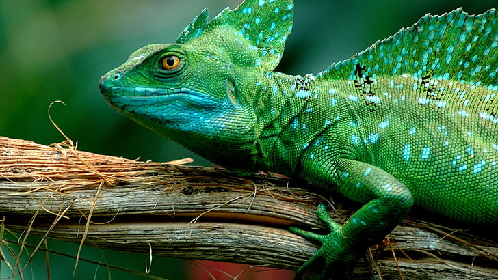
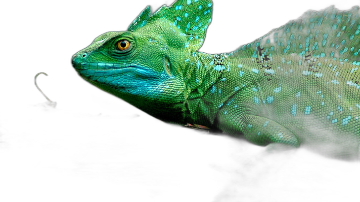

# :zap: Remove Image Background

* Web Automation Project using **Selenium** and **Pytest**

  

## :page_facing_up: Table of Contents   

* [:zap: Remove Image Background](#zap-remove-image-background)
  * [:page_facing_up: Table of contents](#page_facing_up-table-of-contents)
  * [:books: General info](#books-general-info)
  * [:camera: Screenshots](#camera-screenshots)
  * [:signal_strength: Technologies](#signal_strength-technologies)
  * [:floppy_disk: Setup](#floppy_disk-setup)
  * [:computer: Code Examples](#computer-code-examples)
  * [:clipboard: ToDo](#clipboard-todo)
  * [:file_folder: License](#file_folder-license)
  * [:envelope: Contact](#envelope-contact)

## :books: General info

* This script removes the background of a given image

## :camera: Screenshots

### Sample Input Pic

### Result Pic

## :signal_strength: Technologies

* [Python v3.10](https://www.python.org/)
* [Rembg v2.0.30](https://github.com/danielgatis/rembg/)

## :floppy_disk: Setup

* [Install Poetry](https://python-poetry.org/docs/#installation) as Virtual Env
  * create a virtual env with Poetry: `poetry init`
  * access the newly created virtual env: `poetry shell`
* Install Rembg: `poetry add rembg`
 

## :computer: Code Examples

* Rembg CLI
  * `rembg --help`

## :clipboard: ToDo

* ToDo: try out with new images

## :file_folder: License

* MIT

## :envelope: Contact

* Get in touch with [Sambiase](https://github.com/sambiase)
* E-mail: [marsamb@gmail.com](mailto:marsamb@gmail.com)